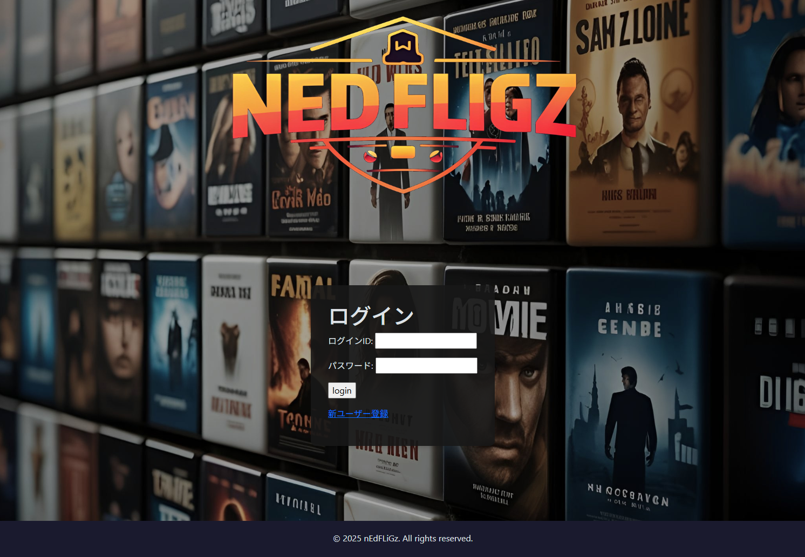
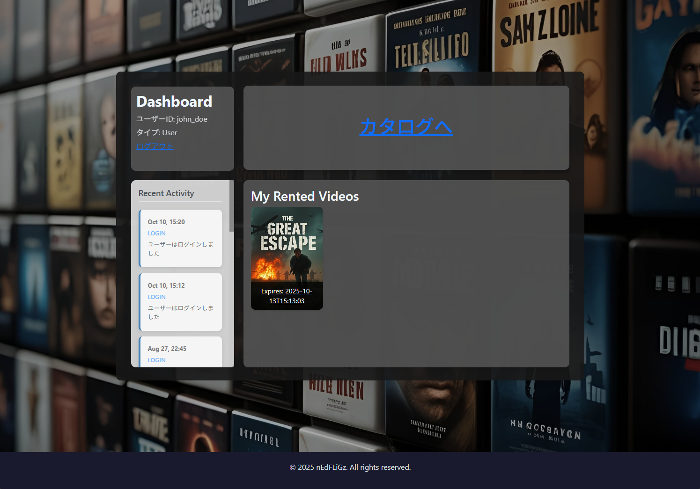
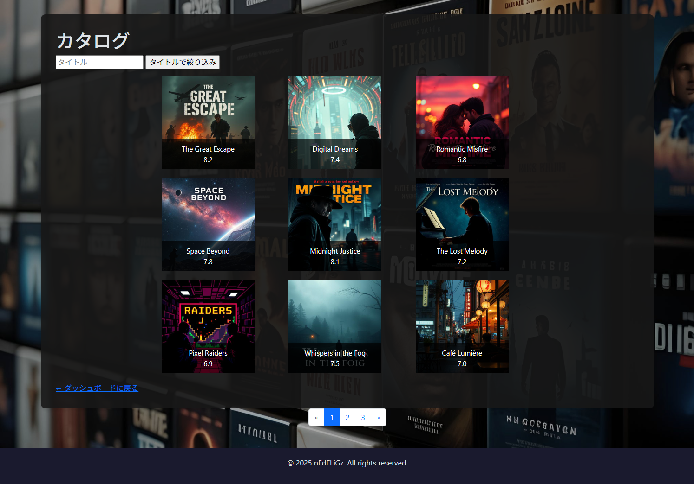
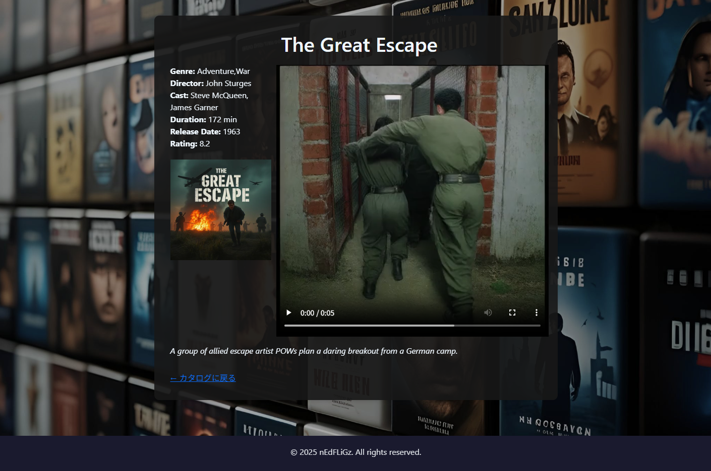

## プロジェクト概要

デジタルビデオレンタルプロジェクトです。カタログから映画をレンタル・視聴できるシステムで、ユーザーと動画の追加機能も備えています。

### 技術スタック
- **バックエンド**: Java, Spring Boot, MyBatis
- **フロントエンド**: JavaScript, CSS, Thymeleaf
- **データベース**: MySQL Workbench

## Screenshots

### ログイン画面

### ダッシュボード

### カタログ

### 動画画面

